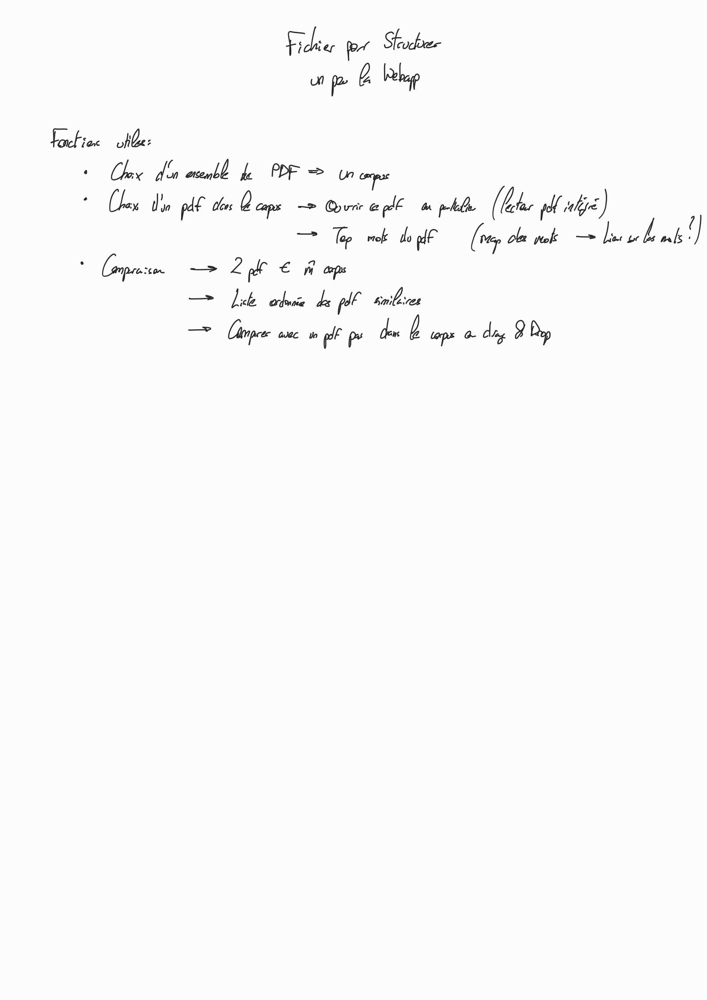
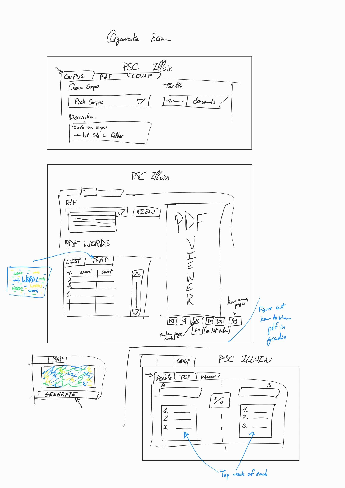
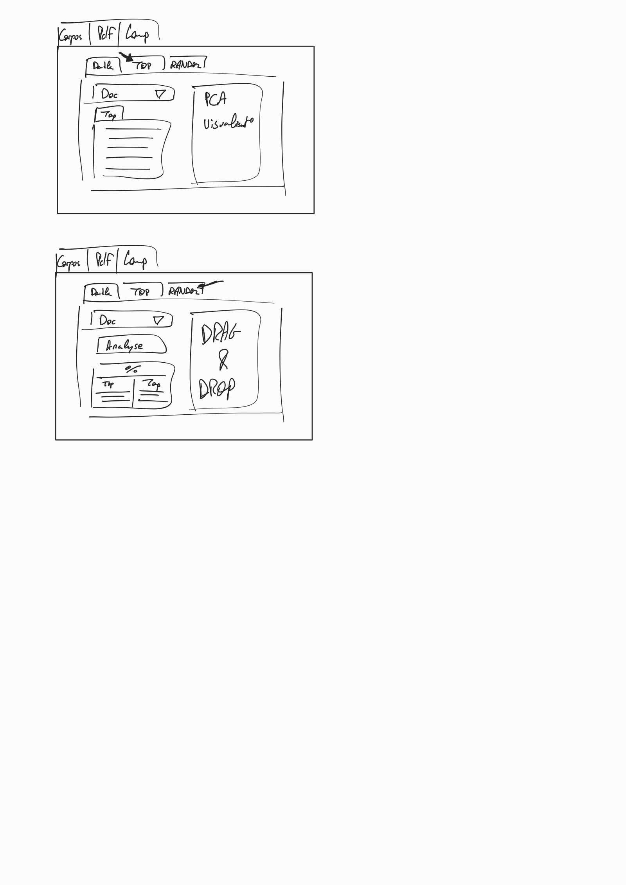

# PSC X Illuin

## Presentation

- Create a tool that helps geographic analysts at UNESCO to grasp the stakes of a region’s education guidelines and compare
worldwide.
- Implement and work on NLP methods to extract the themes of a text corpus with a particular emphasis on
explainability (Word2Vec, LSTMs, Named Entity Recognition, Latent Dirichlet Allocation)
- Design new preprocessing steps in order to reduce the time complexity of NER by 40
- Worked under the supervision of Dr. El Mahdi El Mhamdi and Emile Lucas from Illuin

Nouveau répo, l'architecture des fichiers est plus réfléchie. Plannification à l'avance des fonctions (je me suis posé pour réfléchir à la :sparkles: forme :sparkles: du WebUI). 

Point important Pour setup le projet, je vous conseille de faire un environnement virtuel (virtualenv) et d'installer les dépendances dans ce dernier. Je fais un petit tuto sur comment faire tout ça.

## Installation

J'estime que vous avez déjà installé python3 et pip3. Si ce n'est pas le cas, je vous conseille de faire un petit tour sur le site de python pour installer les deux.

### Cloner le repo

Si vous êtes la c'est que vous avez déjà les droits d'accès au repo. Donc vous pouvez cloner le repo avec la commande suivante:

    git clone https://github.com/Shaamallow/PSC.git

Un peu de doc sur git si vous ne connaissez pas: [Git - Documentation](https://git-scm.com/doc) Franchement allez lire c'est important de savoir s'en servir.

### Créer un environnement virtuel

Pour créer un environnement virtuel, il faut installer le module virtualenv. Pour cela, il faut lancer la commande suivante:

    sudo apt install python3-virtualenv

Une fois que c'est fait, il faut se placer dans le dossier du projet et lancer la commande suivante:

    python3 -m venv env

Cela va créer un dossier env dans le dossier du projet. Pour l'activer, il faut lancer la commande suivante:
    
    source env/bin/activate

Pour quitter l'environnement virtuel, il faut lancer la commande suivante:

    deactivate

### Installer les dépendances

_Assurez vous d'avoir lancé l'environnement virtuel avant de lancer ce qui vient_
Pour installer les dépendances, il faut lancer la commande suivante:

    pip3 install -r requirements.txt

Attention, la librairie NTLK a besoin de télécharger sur votre ordi la liste de stopwords 

Il faut lancer la commande suivante : 

    python -m nltk.downloader all

Plus d'[INFO](https://www.nltk.org/data.html)

**Bon courage pour le code**

## Rapport Final

Rapport au format pdf écrit sur Overleaf disponible sur le repo.

Beaucoup de changement vis à vis de la roadmap, pas de finalisation de la Webapp, developpement d'autres modèles (LDA, NER...)
## Feuille de Route : 

_Disclaimer : j'ai eu la flemme de crop_

(Update feuille de route le 29/11/2022)

