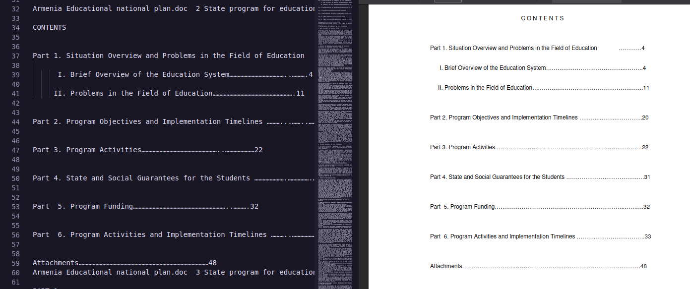
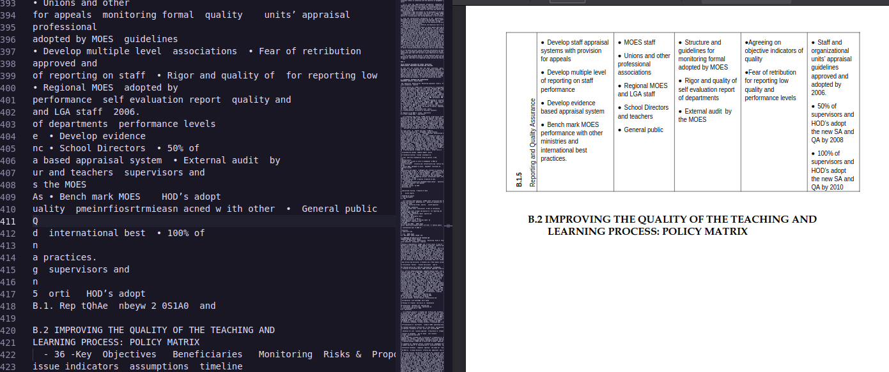
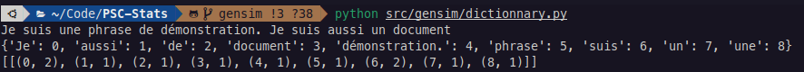
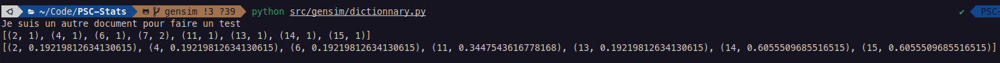
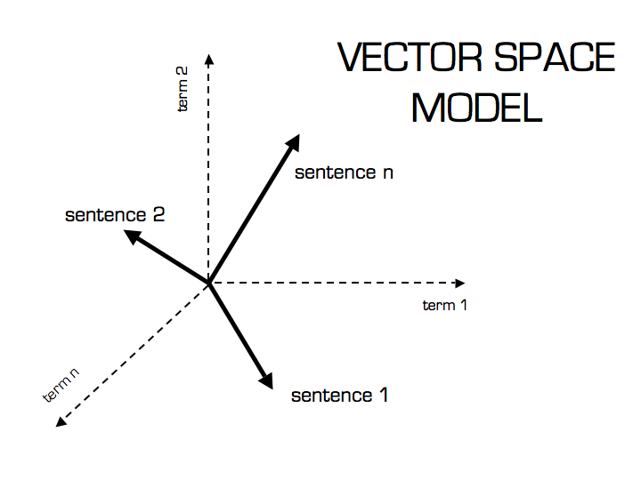
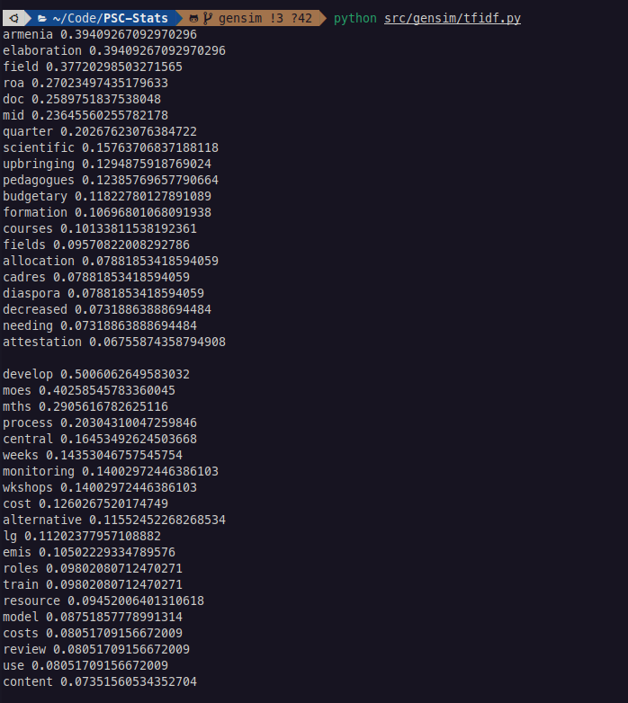
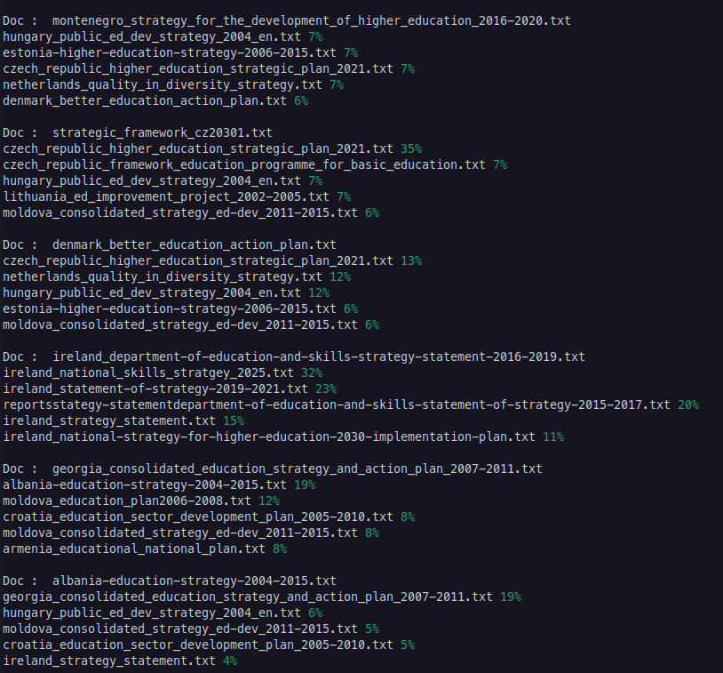

# Rapport Intermédiaire

## PDF2txt 

La première étape de traitement a été de convertir des fichiers pdf en format textuel. 
Afin d'automatiser la conversion, nous avons utilisé la librairie **pdfplumber**. 

Un format .pdf n'est pas fait pour être converti en .txt, ainsi différents problèmes sont apparus dans la conversion : 

- Certains éléments de mise en page sont considéré comme du texte et apparaissent dans les différents import :

- Certains élément ne sont pas importés correctement, en particulier les tableaux et les sommaires, leur import comporte souvent des lignes morceaux de texte isolés.
  
  
- Enfin les termes numériques sont nombreux et difficilement analysables, les numéros de pages et autres annotations chiffrées sont plutot inutiles pour notre problème.

La solution de facilité consistant à retirer les parties problématiques a été choisie puisque l'importation des données ne fait pas parti du PSC. Il aurait été souhaitable qu'un set d'entrainement soit fourni pour l'intégralité du sujet mais nous y reviendront ultérieurement.

Quelques requetes **REGEX** pour formatter le texte fourni sont donc utilisés pour s'assurer que le traitement est bien effectué sur de texte mais des abérations subsistent néanmoins. 

Certains mots sont importés en étant concaténés avec d'autres ce qui rend impossible leur utilisation et au contraire, certaines lettres sont isolés du reste des leurs rendant de nouveau impossible l'analyse. 
Nous avons de nouveau choisi d'éliminer les entrées non cohérents pour faciliter le traitement. 

Cependant quelques difficultés subsistent : Il est difficile de detéminer automatiquement les mots à retirer (pour les lettres isolés ou les mots dépassant les 40 lettres certes mais le problème est plus complexe). Nous pensons ainsi à utiliser des dictionnaires des différents langages appréhendés (en l'occurrence anglais) et vérifier que les termes sons censés.

## Doc2Vec

### Bag Of Words (BOW)

Une fois les importations effectués, un premier modèle abordable est le **Doc2Vec**. 
On modélise chaque document du corpus par un simple vecteur qui formé de tous les mots qui le compose : 

Chaque mot du document est représenté par un couple : (ID, Nombre d'occurrence)

On construit donc de grands vecteurs pour représneter nos documents sans prendre en compte la position des mots dans le document et on peut faire de l'analyse statistque dessus. 

Une des premières méthodes proposée est d'implémenter une métrique pour donner de l'importance aux différents mots : le **TF-IDF**

### TF-IDF

Une première approche consiste à supposer qu'un terme présent de nombreuses fois définit correctement le texte doit avoir de l'importance mais il s'avère que les langues sont sont construites avec de nombreux mots de liaisons et très peu utiles pour définir le sens d'une phrase. On commence donc par retirer tous ces mots appelés **stopwords** pour faciliter l'analyse. 

Cependant pour un corpus donné, il intéressant de pénaliser des mots qui sont propres au contexte donné et non à un document particulier. On utilise donc la métrique **TF-IDF** pour _Term Frequency, Inverse Term Frequency_. On compte les ocurrence d'un mot dans un document et également le nombre de document ou il apparait pour lui donner un poids définitif.

Ainsi on obtient des couples (ID, poids) pour quantifier l'importance des termes dans un texte

### SIM 

Enfin, avec cette métrique implémentée, il est possible de définir à quel points des textes se ressemblent (un % de ressemblance).

On utilise une **cosine-sim** : On réalise le produit scalaire de 2 vecteurs formant chacun un document et on compare les angles pour déterminer la ressemblance. 

Cependant, chaque mot est définit de manière complètement orthogonale à ses pairs. La proximité entre des termes comme "homme" et "corps" est la même que "homme" et "éléphant" ce qui ne rend pas une description cohérente avec le sens des mots. 

Pour remédier à cela, nous creusons actuellement les pistes du **Word2Vec** et **Latent Semantic Analysis** (LSA ou LSI) pour avoir une représentation plus fidèle des documents et des visualisation de leur proximité sur des graphes et non de simples "mesures d'angle". 

### Résultats 

Le TF-IDF donne les termes les plus intéréssant sur les différents corpus : 

Légende :  Top 20 (TF-IDF) mots pour un corpus de 2 documents sur l'éducation -

On remarque cependant que les résultats sont peu lisibles puisque ce sont les racines qui sont analysés. Il est parfois difficile de trouver le sujet qui correspond au mot (mid pour mid-level professional education dans le premier ou MOES = Ministry of Education and Science dans le second) 

Pour la similarité, on obtient les résultats suivants pour un corpus d'environ 20 documents : 

On remarque une bonne cohérence des résultats pour certains domaines (les documents parlant du même pays sont bien regroupés ensemble) mais il est difficile d'apprécier la mesure de similarité puisqu'aucun travail d'analyse n'a été réalisé par un humain. 

Ainsi, nous ne pouvons pas mesurer facilement la pertinence de nos modèles puisque les donnés de test ne sont pas assez adapté à nos besoin.

Une décision commune a été prise avec le tuteur : nous effectueons nos recherches avec des dataset pensés pour ce genre de problèmes afin de perfectionner nos connaissances comme nos modèles et pouvoir interprétrer nos résultats plus sereinement. 

Nous revenons cependant de temps en temps aux corpus d'application proposé lorsque nous avons mieux appréhendés les différents problématiques. 

### Annexes : 

Enfin, une webapp est en cours de développement pour réaliser une démonstration des différentes techniques en temps réel. 
Voila l'état actuel (réalisé avec la librairie **gradio**)

